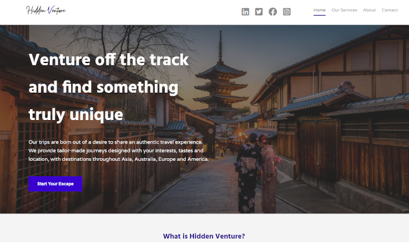
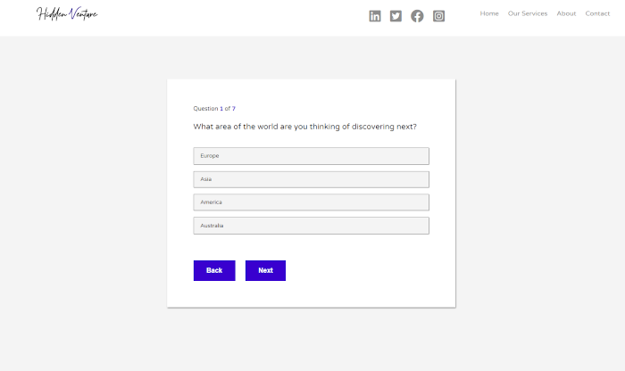

# HiddenVenture_v2

HiddenVenture is a travel website aimed at people who are unsure on the destination they would like to go but would like to explore new locations.
As someone who enjoys to travel this project was a great area for me to explore a personal interest. In this project i was able to implement a form which will ask you 7 questions and then return 3 results based on the answers given.

I have been able to split the results into 4 different continents and then return a result based on the interests selected.

This project is an update of the previous repository built with standard HTML and CSS and now updated using ReactJS. Previous repository can be found here "https://github.com/ShrewdStyle/HiddenVenture"
